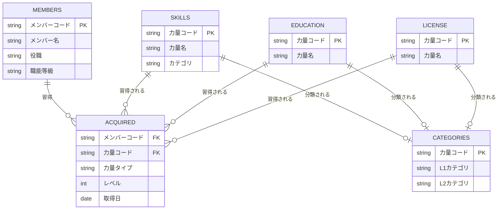
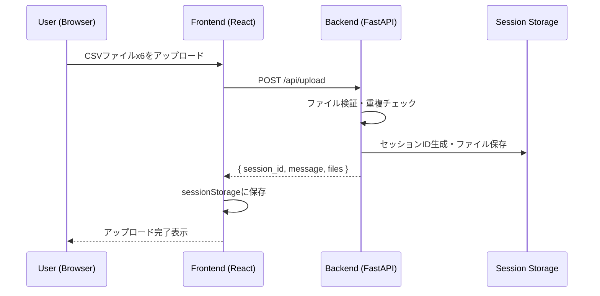
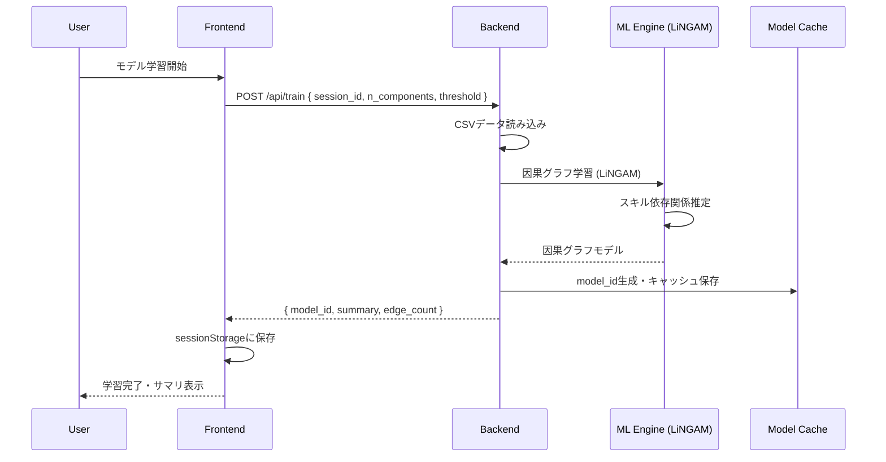
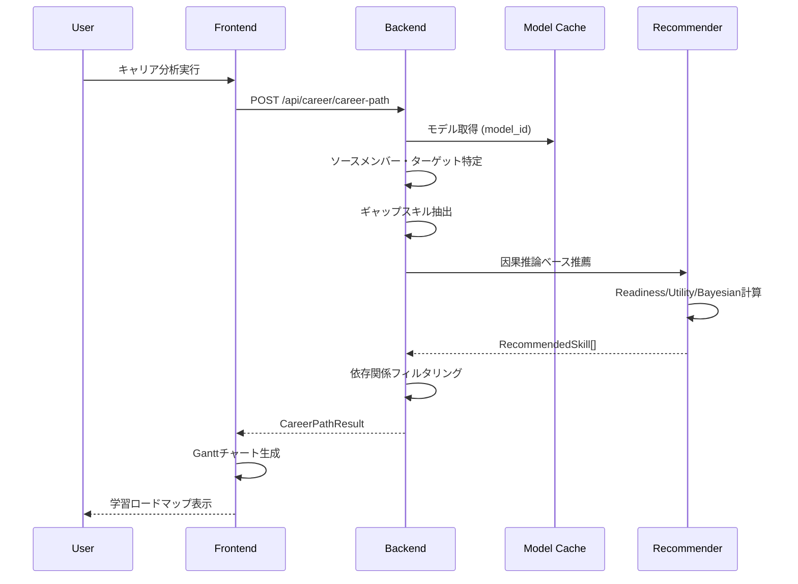
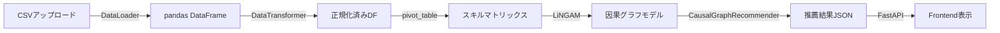
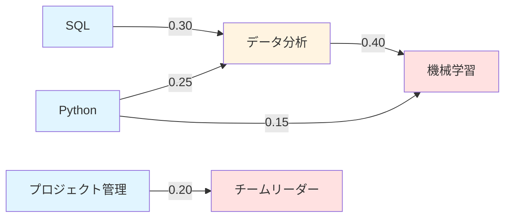
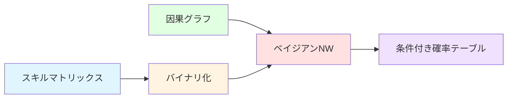
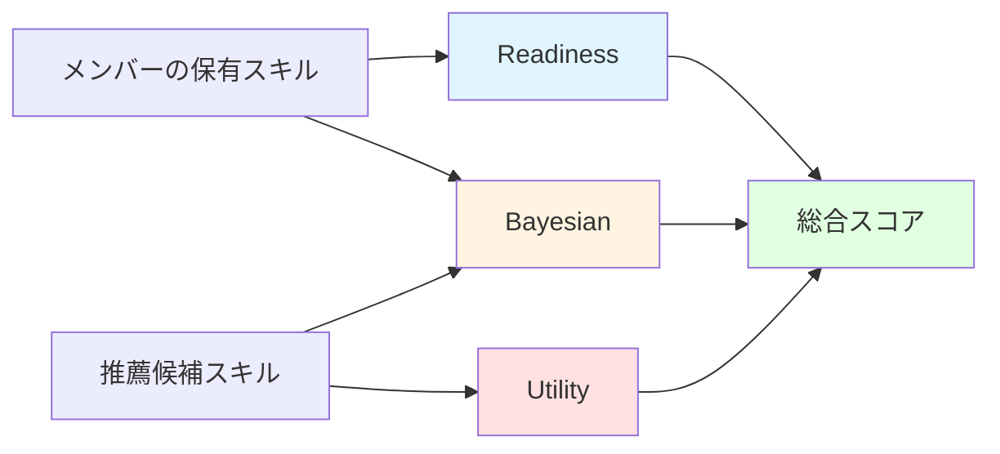

# CareerNavigator WebUI データモデル仕様書

**作成日**: 2025-12-02  
**対象**: 開発部門  
**バージョン**: 2.0 (WebUI実装版)

---

## 📋 目次

1. [概要](#概要)
2. [WebUIアーキテクチャ](#webuiアーキテクチャ)
3. [データソース（CSV構造）](#データソースcsv構造)
4. [Backend APIモデル（Pydantic）](#backend-apiモデルpydantic)
5. [Frontend インターフェース（TypeScript)](#frontend-インターフェースtypescript)
6. [データフロー図](#データフロー図)
7. [APIエンドポイント一覧](#apiエンドポイント一覧)

---

## 概要

CareerNavigator WebUIは、**React + TypeScript (Frontend)** と **FastAPI + Pydantic (Backend)** で構築された、キャリアパス推薦システムのWebアプリケーションです。

### 技術スタック

| 層 | 技術 |
|---|------|
| **Frontend** | React 18 + TypeScript + Vite |
| **Backend** | FastAPI + Pydantic v2 |
| **データストレージ** | セッションベース（一時アップロード） |
| **機械学習** | LiNGAM (因果推論), ベイジアンネットワーク (条件付き確率) |

---

## WebUIアーキテクチャ

```
┌─────────────────────────────────────────────────────────┐
│                    Frontend (React)                     │
│  - DataUpload          : CSVアップロード               │
│  - ModelTraining       : 因果モデル学習                │
│  - EmployeeCareerDashboard : キャリア分析              │
│  - OrganizationalSkillMap  : 組織スキル分析            │
└─────────────────────────────────────────────────────────┘
                          │ HTTP API
┌─────────────────────────────────────────────────────────┐
│                   Backend (FastAPI)                     │
│  - /api/upload/*       : データアップロード管理         │
│  - /api/train/*        : 因果モデル学習                 │
│  - /api/career/*       : キャリア分析API                │
│  - /api/organizational/* : 組織分析API                  │
│  - /api/graph/*        : グラフ可視化API                │
└─────────────────────────────────────────────────────────┘
                          │
┌─────────────────────────────────────────────────────────┐
│             Data Layer (Session Storage)                │
│  - セッション単位でCSVデータを保存                      │
│  - 訓練済みモデルをキャッシュ                           │
└─────────────────────────────────────────────────────────┘
```

---

## データソース(CSV構造)

WebUIでアップロード可能な6種類のCSVファイル

### 1. メンバーマスタ (`members/*.csv`)

**用途**: 組織内のメンバー情報

| カラム名 | データ型 | 必須 | 説明 | 例 |
|---------|---------|-----|------|-----|
| メンバーコード | string | ✅ | メンバーの一意識別子 | `m001`, `m048` |
| メンバー名 | string | ✅ | メンバーの氏名 | `山田 太郎` |
| 役職 | string | ⬜ | 現在の役職 | `課長`, `係長` |
| 職能等級 | string | ⬜ | 職能等級 | `3等級`, `5等級` |

**API応答例**:
```json
{
  "member_code": "m001",
  "member_name": "山田 太郎",
  "role": "課長",
  "display_name": "m001 - 山田 太郎",
  "skill_count": 45
}
```

---

### 2. 習得力量データ (`acquired/*.csv`)

**用途**: メンバーがどの力量をどのレベルで習得したか

| カラム名 | データ型 | 必須 | 説明 | 例 |
|---------|---------|-----|------|-----|
| メンバーコード | string | ✅ | メンバーの識別子 | `m001` |
| 力量コード | string | ✅ | 力量の識別子 | `s001` |
| 力量タイプ | string | ✅ | `SKILL`, `EDUCATION`, `LICENSE` | `SKILL` |
| レベル | integer | ✅ | 習得レベル（0-5または0-3） | `3` |
| 取得日 | date | ⬜ | 習得した日付 | `2024-01-15` |

---

### 3. スキル力量マスタ (`skills/*.csv`)

**用途**: スキル系力量のマスタデータ

| カラム名 | データ型 | 必須 | 説明 |
|---------|---------|-----|------|
| 力量コード | string | ✅ | スキルの一意識別子 |
| 力量名 | string | ✅ | スキルの名称 |
| カテゴリ | string | ⬜ | 所属カテゴリ |

---

### 4. 教育力量マスタ (`education/*.csv`)

| カラム名 | データ型 | 必須 | 説明 |
|---------|---------|-----|------|
| 力量コード | string | ✅ | 教育の一意識別子 |
| 力量名 | string | ✅ | 教育の名称 |

---

### 5. 資格力量マスタ (`license/*.csv`)

| カラム名 | データ型 | 必須 | 説明 |
|---------|---------|-----|------|
| 力量コード | string | ✅ | 資格の一意識別子 |
| 力量名 | string | ✅ | 資格の名称 |

---

### 6. カテゴリマスタ (`categories/*.csv`)

**用途**: 力量のカテゴリ階層を定義

| カラム名 | データ型 | 必須 | 説明 |
|---------|---------|-----|------|
| 力量コード | string | ✅ | 力量の識別子 |
| L1カテゴリ | string | ⬜ | 大カテゴリ |
| L2カテゴリ | string | ⬜ | 中カテゴリ |

---

## Backend APIモデル(Pydantic)

### データアップロード関連

#### UploadResponse
```python
{
  "session_id": str,        # セッションID (例: "session_1701504000")
  "message": str,           # 処理結果メッセージ
  "files": List[str]        # アップロードされたカテゴリ ["members", "acquired", ...]
}
```

---

### モデル学習関連

#### TrainRequest (リクエスト)
```python
class TrainRequest(BaseModel):
    session_id: str
    min_members_per_skill: int = 5
    correlation_threshold: float = 0.2
    weights: Optional[Dict[str, float]] = None  # readiness_weight, utility_weight, bayesian_weight
```

#### TrainResponse (レスポンス)
```python
class TrainResponse(BaseModel):
    success: bool
    model_id: str
    summary: Dict[str, Any]    # 訓練サマリ
    skill_count: int
    edge_count: int
    execution_time: float
```

---

### キャリアダッシュボード関連

#### MemberSkillsRequest
```python
class MemberSkillsRequest(BaseModel):
    session_id: str
    member_code: str
```

#### SkillInfo
```python
class SkillInfo(BaseModel):
    skill_code: str
    skill_name: str
    category: str
    level: int = 1
```

#### GapAnalysisRequest
```python
class GapAnalysisRequest(BaseModel):
    session_id: str
    model_id: str
    source_member_code: str
    target_member_code: str
    min_total_score: float = 0.3
    min_readiness_score: float = 0.0
```

#### GapAnalysisResult (レスポンス)
```python
{
  "success": bool,
  "source_member": {
    "member_code": str,
    "member_name": str,
    "role": str,
    "skill_count": int
  },
  "target_member": { ... },
  "gap_skills": [
    {
      "skill_code": str,
      "skill_name": str,
      "category": str
    }
  ],
  "gap_count": int,
  "completion_rate": float
}
```

#### RecommendedSkill
```python
class RecommendedSkill(BaseModel):
    competence_code: str
    competence_name: str
    category: str
    total_score: float              # 総合スコア
    readiness_score: float          # 準備完了度 (0-1)
    bayesian_score: float           # 確率スコア (0-1)
    utility_score: float            # 有用性スコア (0-1)
    readiness_reasons: List[Tuple[str, float]]  # [(スキル名, 因果効果)]
    utility_reasons: List[Tuple[str, float]]
    prerequisites: List[str]        # 前提スキルリスト
    enables: List[str]              # 次に繋がるスキルリスト
```

#### CareerPathRequest
```python
class CareerPathRequest(BaseModel):
    session_id: str
    model_id: str
    source_member_code: str
    target_member_code: str
    min_total_score: float = 0.3
    min_readiness_score: float = 0.0
    min_effect_threshold: float = 0.03
```

#### RoadmapRequest
```python
class RoadmapRequest(BaseModel):
    session_id: str
    model_id: str
    source_member_code: str
    target_member_code: str
    target_member_name: str
    min_total_score: float = 0.3
    min_readiness_score: float = 0.0
    min_effect_threshold: float = 0.03
```

---

### 役職ベース分析関連

#### RoleSkillsRequest
```python
class RoleSkillsRequest(BaseModel):
    session_id: str
    role_name: str
    min_frequency: float = 0.1
```

#### RoleSkillInfo
```python
class RoleSkillInfo(BaseModel):
    skill_code: str
    skill_name: str
    category: str
    frequency: float        # 保有率 (0.0-1.0)
    member_count: int       # 保有人数
    priority: str           # "HIGH" | "MEDIUM" | "LOW"
```

#### RoleGapAnalysisRequest
```python
class RoleGapAnalysisRequest(BaseModel):
    session_id: str
    model_id: str
    source_member_code: str
    target_role: str
    min_frequency: float = 0.1
    min_total_score: float = 0.3
    min_readiness_score: float = 0.0
```

---

### 組織分析関連

#### OrganizationalMetricsRequest
```python
class OrganizationalMetricsRequest(BaseModel):
    session_id: str
```

#### SkillGapAnalysisRequest
```python
class SkillGapAnalysisRequest(BaseModel):
    session_id: str
    min_coverage_threshold: float = 0.3
```

#### SuccessionPlanningRequest
```python
class SuccessionPlanningRequest(BaseModel):
    session_id: str
    target_member_code: str
    min_similarity: float = 0.5
```

---

### グラフ可視化関連

#### EgoGraphRequest
```python
class EgoGraphRequest(BaseModel):
    model_id: str
    center_node: str
    radius: int = 1
    threshold: float = 0.05
    show_negative: bool = False
    member_skills: List[str] = []
```

#### FullGraphRequest
```python
class FullGraphRequest(BaseModel):
    model_id: str
    threshold: float = 0.05
    show_negative: bool = False
```

---

## Frontend インターフェース(TypeScript)

### EmployeeCareerDashboard.tsx

#### MemberInfo
```typescript
interface MemberInfo {
  member_code: string;
  member_name: string;
  role: string;
  skill_count?: number;
  display_name?: string;
}
```

#### Skill
```typescript
interface Skill {
  skill_code: string;
  skill_name: string;
  category: string;
  level: number;
}
```

#### RecommendedSkill
```typescript
interface RecommendedSkill {
  competence_code: string;
  competence_name: string;
  category: string;
  total_score: number;
  readiness_score: number;
  bayesian_score: number;
  utility_score: number;
  readiness_reasons: [string, number][];
  utility_reasons: [string, number][];
  prerequisites: { skill_name: string; effect: number }[];
  enables: { skill_name: string; effect: number }[];
  explanation?: string;
}
```

#### GapAnalysisResult
```typescript
interface GapAnalysisResult {
  success: boolean;
  source_member: MemberInfo;
  target_member: MemberInfo;
  gap_skills: { skill_code: string; skill_name: string; category: string }[];
  gap_count: number;
  source_skill_count: number;
  target_skill_count: number;
  completion_rate: number;
}
```

#### CareerPathResult
```typescript
interface CareerPathResult {
  success: boolean;
  recommended_skills: RecommendedSkill[];
  skill_count: number;
  avg_score: number;
  total_dependencies: number;
  estimated_months: number;
  message: string;
}
```

#### RoleSkillStats
```typescript
interface RoleSkillStats {
  success: boolean;
  role_name: string;
  total_members: number;
  skills: {
    skill_code: string;
    skill_name: string;
    category: string;
    frequency: number;
    member_count: number;
    priority: string;
  }[];
  skill_count: number;
}
```

---

### OrganizationalSkillMap.tsx

#### OrganizationalMetrics
```typescript
interface OrganizationalMetrics {
  total_members: number;
  total_skills: number;
  avg_skills_per_member: number;
  skill_coverage_by_category: { [key: string]: number };
  top_skills_by_frequency: TopSkill[];
  role_distribution: { [key: string]: number };
}
```

#### TopSkill
```typescript
interface TopSkill {
  skill_code: string;
  skill_name: string;
  category: string;
  member_count: number;
  coverage_rate: number;
}
```

#### SkillGap
```typescript
interface SkillGap {
  skill_code: string;
  skill_name: string;
  category: string;
  member_count: number;
  coverage_rate: number;
  gap_severity: string;  // "HIGH" | "MEDIUM" | "LOW"
}
```

#### SuccessionCandidate
```typescript
interface SuccessionCandidate {
  member_code: string;
  member_name: string;
  role: string;
  similarity_score: number;
  common_skills: number;
  gap_skills: number;
  readiness_level: string;  // "HIGH" | "MEDIUM" | "LOW"
}
```

---

### CausalRecommendation.tsx

#### Member
```typescript
interface Member {
  member_code: string;
  member_name: string;
  display_name: string;
}
```

#### Recommendation
```typescript
interface Recommendation {
  competence_code: string;
  competence_name: string;
  category: string;
  total_score: number;
  readiness_score: number;
  bayesian_score: number;
  utility_score: number;
  readiness_reasons: [string, number][];
  utility_reasons: [string, number][];
  explanation?: string;
}
```

#### RecommendationResponse
```typescript
interface RecommendationResponse {
  success: boolean;
  member_info: {
    member_code: string;
    member_name: string;
    current_skills: number;
  };
  recommendations: Recommendation[];
  message: string;
}
```

---

### ModelTraining.tsx

#### TrainingSummary
```typescript
interface TrainingSummary {
  model_id: string;
  members_count: number;
  competences_count: number;
  edges_count: number;
  avg_causal_effect: number;
  top_dependencies: [string, string, number][];
  execution_time: number;
}
```

---

## ER図

### CSVデータ構造のER図

WebUIで使用される6種類のCSVファイル間の関係性を示します。



**関係性の説明**:
- **MEMBERS** (メンバーマスタ): 組織内のメンバー情報
- **ACQUIRED** (習得力量): メンバーと力量の多対多関係を表す中間テーブル
- **SKILLS/EDUCATION/LICENSE**: 3種類の力量マスタ
- **CATEGORIES**: 力量のカテゴリ階層分類

---

## データフロー図

### 1. データアップロードフロー



---

### 2. モデル学習フロー



---

### 3. キャリアパス生成フロー



---

## APIエンドポイント一覧

### データ管理 (`/api/upload/*`)

| メソッド | エンドポイント | 説明 |
|---------|---------------|------|
| POST | `/upload` | CSVファイルアップロード（6カテゴリ） |
| GET | `/session/{session_id}/status` | セッション状態確認 |
| DELETE | `/session/{session_id}` | セッション削除 |
| GET | `/sessions/stats` | セッション統計 |
| POST | `/sessions/cleanup` | 古いセッションのクリーンアップ |
| GET | `/session/{session_id}/members` | メンバーリスト取得 |

---

### モデル学習 (`/api/train/*`)

| メソッド | エンドポイント | 説明 |
|---------|---------------|------|
| POST | `/train` | 因果グラフモデル学習 |

---

### キャリアダッシュボード (`/api/career/*`)

| メソッド | エンドポイント | 説明 |
|---------|---------------|------|
| GET | `/members` | 利用可能メンバーリスト |
| GET | `/roles` | 利用可能役職リスト |
| POST | `/member-skills` | メンバーの保有スキル取得 |
| POST | `/gap-analysis` | ギャップ分析（メンバー比較） |
| POST | `/career-path` | キャリアパス生成 |
| POST | `/career-roadmap` | ロードマップ(Gantt)生成 |

---

### 役職ベース分析 (`/api/career/role/*`)

| メソッド | エンドポイント | 説明 |
|---------|---------------|------|
| POST | `/role-skills` | 役職の代表的スキル取得 |
| POST | `/gap-analysis` | ギャップ分析（役職比較） |
| POST | `/career-path` | 役職ベースキャリアパス |
| POST | `/career-roadmap` | 役職ベースロードマップ |

---

### 組織分析 (`/api/organizational/*`)

| メソッド | エンドポイント | 説明 |
|---------|---------------|------|
| POST | `/metrics` | 組織メトリクス取得 |
| POST | `/skill-gap-analysis` | 組織スキルギャップ分析 |
| POST | `/succession-planning` | 後継者計画候補取得 |
| POST | `/simulation` | What-Ifシミュレーション |

---

### グラフ可視化 (`/api/graph/*`)

| メソッド | エンドポイント | 説明 |
|---------|---------------|------|
| POST | `/ego` | エゴグラフ生成（特定スキル中心） |
| POST | `/full` | 全体グラフ生成 |

---

### 重み最適化 (`/api/weights/*`)

| メソッド | エンドポイント | 説明 |
|---------|---------------|------|
| POST | `/update` | スコア重み手動更新 |
| POST | `/optimize` | 重み自動最適化 (Optuna) |

---

## データ変換フロー



### LiNGAM学習時のデータ構造

#### 1. CSV読み込み後（正規化済みDataFrame）

`member_competence` DataFrame:

| メンバーコード | 力量コード | 力量名 | 力量タイプ | レベル | 正規化レベル |
|--------------|----------|--------|-----------|-------|------------|
| m001 | s001 | Python開発 | SKILL | 3 | 3.0 |
| m001 | s002 | SQL | SKILL | 5 | 5.0 |
| m002 | s001 | Python開発 | SKILL | 4 | 4.0 |
| m002 | e001 | 安全衛生教育 | EDUCATION | 2 | 3.33 |

#### 2. スキルマトリックス変換（pivot_table）

LiNGAM学習のため、**メンバー × スキル** の2次元マトリックスに変換:

```python
skill_matrix = member_competence.pivot_table(
    index='メンバーコード',
    columns='力量名',  # または '力量コード'
    values='正規化レベル',
    fill_value=0.0
)
```

**変換後のスキルマトリックス**:

|  | Python開発 | SQL | データ分析 | 機械学習 | ... |
|------|----------|-----|----------|---------|-----|
| m001 | 3.0 | 5.0 | 0.0 | 4.0 | ... |
| m002 | 4.0 | 0.0 | 3.0 | 0.0 | ... |
| m003 | 0.0 | 4.0 | 5.0 | 3.0 | ... |
| ...  | ... | ... | ... | ... | ... |

- **行**: メンバー（約200-300名）
- **列**: スキル（約300-500種類）
- **値**: 正規化レベル（0.0-5.0）
  - `0.0` = 未習得
  - `1.0-5.0` = 習得レベル

#### 3. LiNGAMによる因果グラフ学習

スキルマトリックスから**スキル間の因果関係**を学習:

```python
# LiNGAMアルゴリズムで因果グラフを推定
adj_matrix = lingam.fit(skill_matrix)
```

**学習された因果グラフ例**:



**因果効果の解釈**:
- `Python → データ分析` = **0.25**
  - 「Pythonを習得すると、データ分析の習得が0.25容易になる」
- `SQL → データ分析` = **0.30**
  - 「SQLを習得すると、データ分析の習得が0.30容易になる」
- `データ分析 → 機械学習` = **0.40**
  - 「データ分析を習得すると、機械学習の習得が0.40容易になる」

---

#### 4. ベイジアンネットワーク学習

LiNGAMで得られた因果グラフをベースに、**条件付き確率**を学習します。

**ステップ**:



**プロセス説明**:
1. **スキルマトリックス** (数値 0.0-5.0) → **バイナリ化** (0 or 1)
2. **因果グラフ** (LiNGAMから得られた構造) + バイナリデータ → **ベイジアンネットワーク**で学習
3. **条件付き確率テーブル** P(スキル | 親スキル) を生成

**具体例**: 「データ分析」スキルの条件付き確率テーブル

因果グラフから、「データ分析」の親スキルは「Python」と「SQL」です。

| Python | SQL | P(データ分析=1) |
|--------|-----|-------------------|
| 0 | 0 | 0.10 |
| 0 | 1 | 0.35 |
| 1 | 0 | 0.42 |
| **1** | **1** | **0.78** |

**解釈**:
- PythonもSQLも持っていない人 → 10%がデータ分析を習得
- **PythonとSQLの両方を持っている人 → 78%がデータ分析を習得**

---

#### 5. 推薦スコア計算（詳細フロー）

学習済みモデルを使用して、各メンバーへの推薦スコアを**3軸**で計算します。



**スコア計算フロー**:
- **入力**: メンバーの保有スキル (Python, SQL) + 推薦候補スキル (データ分析)
- **計算**: ①Readiness (準備完了度) + ②Bayesian (習得確率) + ③Utility (有用性)
- **出力**: 総合スコア = 0.6*R + 0.3*B + 0.1*U

**具体例**: メンバーm001への「データ分析」推薦

##### ① Readiness Score (準備完了度)

**計算方法**: 保有スキルからターゲットスキルへの因果効果の合計

```
保有スキル:
  - Python  → データ分析: 0.25
  - SQL     → データ分析: 0.30

Readiness = 0.25 + 0.30 = 0.55
正規化後: 0.55 / 1.0 = 0.55
```

✅ **意味**: 「PythonとSQLを既に持っているので、データ分析を学ぶ準備ができています」

---

##### ② Bayesian Score (習得確率)

**計算方法**: P(ターゲットスキル=1 | 保有スキル)

```
P(データ分析=1 | Python=1, SQL=1) = 0.78

Bayesian = 0.78
```

✅ **意味**: 「PythonとSQLを持っている人の78%がデータ分析を習得しています」

---

##### ③ Utility Score (有用性)

**計算方法**: ターゲットスキルから将来のスキルへの因果効果の合計

```
未習得スキル:
  - データ分析 → 機械学習: 0.40
  - データ分析 → 深層学習: 0.35

Utility = 0.40 + 0.35 = 0.75
正規化後: 0.75 / 2.0 = 0.38
```

✅ **意味**: 「データ分析を学ぶと、将来の機械学習や深層学習の習得が容易になります」

---

##### 総合スコア

**計算式** (デフォルト重み):

```
Total Score = Readiness * 0.6 + Bayesian * 0.3 + Utility * 0.1
            = 0.55 * 0.6 + 0.78 * 0.3 + 0.38 * 0.1
            = 0.33 + 0.234 + 0.038
            = 0.602
```

**最終推薦スコア**: **0.60** / 1.0

---

**推薦理由の生成**:

```
【習得の準備ができています】
・Python開発 の経験があるため (因果効果: 0.25)
・SQL の経験があるため (因果効果: 0.30)
・同様のスキルセットを持つ方の78%がこのスキルを習得しています

【このスキルが役立つ場面】
・機械学習 の習得に役立ちます (因果効果: 0.40)
・深層学習 の習得に役立ちます (因果効果: 0.35)
```

---

## セッション管理

WebUIはセッションベースでデータを管理します。

### セッションライフサイクル

```
1. ユーザーがCSVをアップロード
   ↓
2. session_id生成 (例: "session_1701504000")
   ↓
3. 一時ディレクトリにCSV保存
   (/tmp/uploads/session_1701504000/)
   ↓
4. sessionStorageに保存
   - career_session_id
   - career_data_uploaded
   - career_model_id
   ↓
5. モデル学習・分析実行
   ↓
6. セッション有効期限24時間
   ↓
7. 自動クリーンアップ or 手動削除
```

---

## データ品質ルール

### 1. 重複チェック
- 同一カテゴリの複数CSVファイル間で重複行を検出
- 重複がある場合はエラーを返す

### 2. 必須カラムチェック
- 各CSVファイルの必須カラムを検証
- カラム不足時はエラーメッセージを返す

### 3. レベル正規化
- SKILL: 0-5 (そのまま)
- EDUCATION/LICENSE: 0-3 → 0-5にスケーリング

---

## 関連ドキュメント

- [WebUIガイド](file:///c:/Users/加藤裕樹/OneDrive%20-%20株式会社Skillnote/デスクトップ/CareerNavigator/docs/WEBUI_GUIDE.md)
- [README](file:///c:/Users/加藤裕樹/OneDrive%20-%20株式会社Skillnote/デスクトップ/CareerNavigator/README.md)
- [アーキテクチャドキュメント](file:///c:/Users/加藤裕樹/OneDrive%20-%20株式会社Skillnote/デスクトップ/CareerNavigator/docs/ARCHITECTURE.md)

---

## 変更履歴

| バージョン | 日付 | 変更内容 |
|-----------|------|---------|
| 2.0 | 2025-12-02 | WebUI実装版に刷新。Backend API・Frontend Interfaceに限定 |
| 1.0 | 2025-12-02 | 初版作成（全データモデル） |
